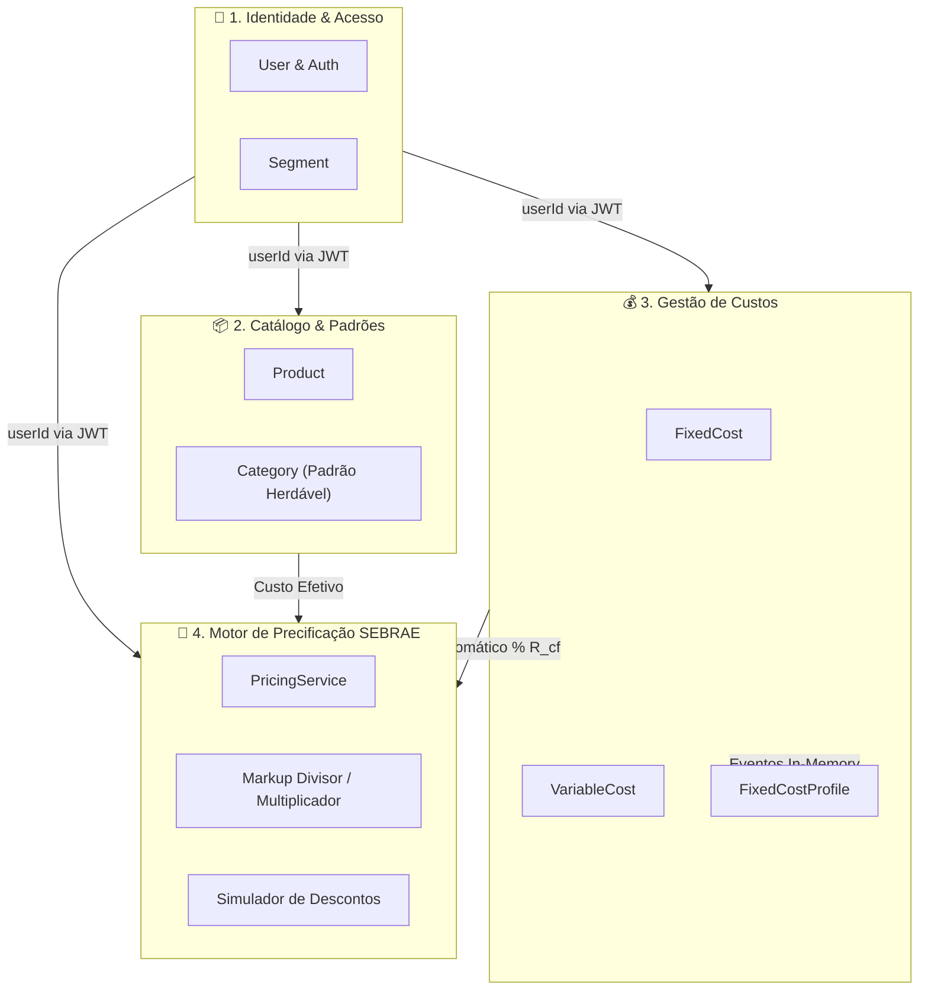

# Limites de Contexto e Bounded Contexts — Margem.AI

## 1. Visão Geral da Arquitetura
O **Margem.AI** é modelado sob a arquitetura de **Monolito Modular**, integrando regras tributárias e de precificação do SEBRAE para Microempreendedores Individuais.

---

## 2. Decisão Arquitetural Vinculada
* [[09-DECISIONS/ADR-001-modular-monolith|ADR-001: Adoção de Monolito Modular em vez de Microservices]]
* [[00-CORE/engineering-principles|Princípios de Engenharia do SE-OS]]
