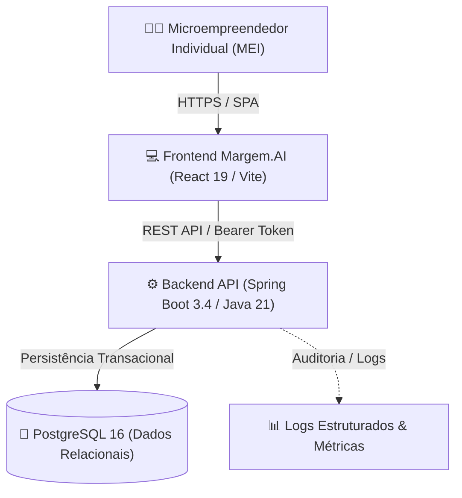

# ARCH-001: Modelagem de Limites de Contexto — Margem.AI

## 1. Visão Geral e Escopo do Sistema
O **Margem.AI** é uma plataforma desenhada para microempreendedores individuais (MEIs) com foco em precificação segura, cálculo de markup e monitoramento de margem de contribuição segundo as diretrizes do **SEBRAE**.

* **Atributos de Qualidade Prioritários:**
  * **Corretude e Determinismo Matemático:** Zero tolerância a erros em cálculos de markup e taxas tributárias.
  * **Isolamento Multitenant Rigoroso:** Garantia estrita de que nenhum MEI visualize ou altere custos e produtos de outros usuários.
  * **Simplicidade Operacional (KISS/YAGNI):** Custo de infraestrutura reduzido para manter a plataforma financeiramente sustentável para o público MEI.

---

## 2. Diagrama de Contexto do Sistema (C4 - Nível 1)



---

## 3. Mapeamento dos Bounded Contexts (DDD Estratégico)

A plataforma é estruturada como um **Monolito Modular** segregado em quatro contextos delimitados:

```mermaid
flowchart TB
    subgraph IAM ["🔑 1. Contexto de Identidade & Acesso (IAM)"]
        UserEntity["User"]
        SegmentEntity["Segment"]
        AuthSvc["AuthService & JwtService"]
    end

    subgraph Catalog ["📦 2. Contexto de Catálogo & Categorias"]
        ProductEntity["Product"]
        CategoryEntity["Category"]
        CatCache["CategoryParameterCache"]
    end

    subgraph Costs ["💰 3. Contexto de Gestão de Custos"]
        FixedCostEntity["FixedCost"]
        VariableCostEntity["VariableCost"]
        CostProfileEntity["FixedCostProfile"]
    end

    subgraph PricingEngine ["🧮 4. Contexto de Precificação SEBRAE"]
        PricingSvc["PricingService"]
        FormulaEngine["Motor de Markup Divisor/Multiplicador"]
        DiscountSim["Simulador de Desconto de Balcão"]
    end

    IAM -->|userId via Token JWT| Catalog
    IAM -->|userId via Token JWT| Costs
    IAM -->|userId via Token JWT| PricingEngine
    
    Catalog -->|Custo Efetivo & Margem Padrão| PricingEngine
    Costs -->|Rateio de Custos Fixos (% R_cf)| PricingEngine
    Costs -.->|Eventos In-Memory (Spring)| CostProfileEntity
```

---

## 4. Definição e Responsabilidade de Cada Contexto

### 1. Contexto de Identidade & Acesso (`com.example.margemAI.security`)
* **Responsabilidade:** Registro do empreendedor (CNPJ, nome, email, senha com BCrypt), emissão/validação de tokens JWT e associação ao segmento econômico inicial (`Segment`).
* **Fronteira:** Fornece o `UUID userId` autenticado para todos os demais contextos via `SecurityContextHolder`. Não possui regras de precificação.

### 2. Contexto de Catálogo & Categorias (`model/Product`, `model/Category`)
* **Responsabilidade:** Gerenciamento do catálogo de produtos e serviços prestados pelo MEI.
* **Comportamento Chave:** As categorias atuam como **Padrões de Precificação Herdáveis**, permitindo que produtos herdem margem de lucro e tributos automaticamente caso não definam margens individuais.

### 3. Contexto de Gestão de Custos (`model/FixedCost`, `model/VariableCost`)
* **Responsabilidade:** Rastreamento de despesas fixas recorrentes do negócio (aluguel, assessoria contábil, internet) e custos variáveis atribuídos a produtos específicos (matérias-primas, insumos, embalagens).
* **Comunicação por Eventos:** Dispara `FixedCostsRecalculatedEvent` sempre que um custo fixo for inserido, alterado ou excluído.

### 4. Contexto de Precificação SEBRAE (`service/PricingService`)
* **Responsabilidade:** O núcleo do valor de negócio. Aplica as fórmulas de Markup do SEBRAE:
  $$\text{Markup Multiplicador} = \frac{100}{100 - (R_{cf}\% + V\% + M\% + T\%)}$$
  $$\text{Preço Mínimo} = \frac{\text{Custo Efetivo} \times 100}{100 - \sum\%}$$
* **Regra de Ouro:** Rejeição incondicional (`422 Unprocessable Entity`) de somatórios de percentuais $\ge 100\%$.

---

## 5. Diagrama de Containers & Componentes (C4 - Nível 2)

```mermaid
flowchart LR
    subgraph Browser ["Navegador do Cliente"]
        SPA["React 19 SPA (Vite / Tailwind v4)"]
        TokenStore["Token Storage (JWT)"]
    end

    subgraph CloudServer ["Servidor de Aplicação"]
        Nginx["Reverse Proxy / TLS Termination"]
        
        subgraph SpringApp ["Spring Boot 3.4 Container"]
            SecFilter["JwtAuthenticationFilter"]
            RestControllers["REST Controllers (/v1/*)"]
            Services["Domain Services"]
            SpringData["Spring Data JPA Repositories"]
        end
    end

    subgraph DataTier ["Camada de Dados"]
        Postgres[("PostgreSQL 16")]
    end

    SPA -->|HTTPS REST| Nginx
    Nginx --> SecFilter
    SecFilter --> RestControllers
    RestControllers --> Services
    Services --> SpringData
    SpringData -->|JDBC Pool (HikariCP)| Postgres
```

---

## 6. Trade-offs Arquiteturais Documentados
* `[[ADR-001-modular-monolith-over-microservices]]` - Adoção de Monolito Modular em vez de Microservices distribuídos.
* `[[ADR-002-in-memory-spring-events]]` - Eventos in-memory via `ApplicationEventPublisher` para sincronização de rateio de custos.
