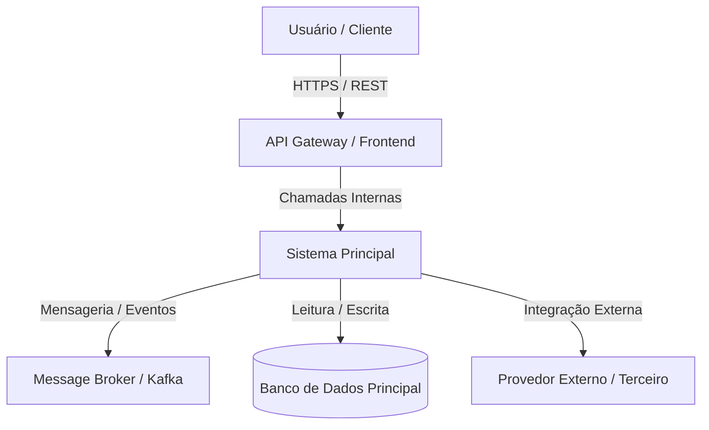

# ARCH-000: Visão Arquitetural - [Nome do Sistema]

## 1. Visão Geral e Objetivos do Negócio
Declaração do propósito do sistema, usuários-alvo e atributos de qualidade prioritários (Disponibilidade, Latência, Segurança, Manutenibilidade).

---

## 2. Diagrama de Contexto (C4 - Nível 1)

---

## 3. Diagrama de Containers & Componentes (C4 - Nível 2/3)
Descrição dos limites de processos, fronteiras de dados e módulos principais:
* **Frontend Container**: SPA em React / Angular comunicando via API Gateway.
* **Backend API Container**: Serviço Spring Boot / Node.js contendo as regras de negócio em camadas desacopladas.
* **Database Container**: PostgreSQL com réplica de leitura.

---

## 4. Estilo Arquitetural & Princípios
* **Estilo Escolhido**: Monolito Modular / Microservices / Clean Architecture / Hexagonal.
* **Isolamento de Domínio**: Portas e Adaptadores isolando infraestrutura e frameworks das regras centrais.
* **Comunicação entre Módulos**: Chamadas síncronas in-memory para módulos locais; filas assíncronas para integrações desacopladas.

---

## 5. Requisitos Não-Funcionais & Trade-offs
* **Disponibilidade**: SLA 99.9%.
* **Latência**: SLA $p99 < 500ms$ nas rotas transacionais críticas.
* **Segurança**: Autenticação via JWT / OAuth2 com verificação de permissões por endpoint.
* **Trade-offs Aceitos**: Complexidade de setup local em prol de isolamento rigoroso de regras de negócio.

---

## 6. Decisões Arquiteturais Vinculadas (ADRs)
* `[[ADR-001]]` - Escolha do Banco de Dados
* `[[ADR-002]]` - Estratégia de Autenticação
