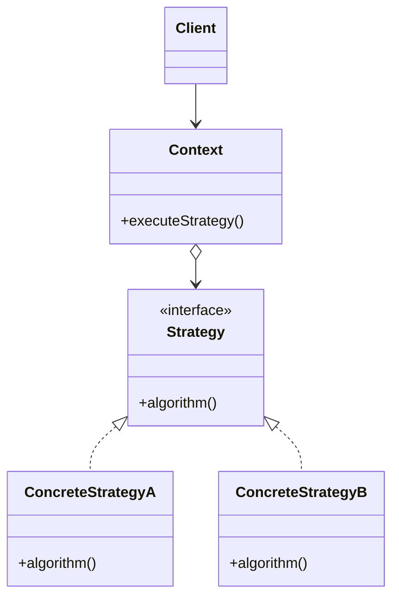

# PAT-000: Nome do Padrão

## 1. Intenção & Propósito
O que este padrão resolve? Qual benefício estrutural ele proporciona?

---

## 2. Quando Utilizar
* Cenário A: Quando múltiplos algoritmos intercambiáveis precisarem ser selecionados em tempo de execução sem cadeias excessivas de if/else.
* Cenário B: Quando for necessário desacoplar o remetente de uma solicitação do seu destinatário.

---

## 3. Quando NÃO Utilizar (Anti-Overengineering)
* Não utilizar se houver apenas uma ou duas implementações que raramente mudarão (evitar complexidade acidental).
* Não utilizar se uma função pura de ordem superior resolver o problema com menor indireção.

---

## 4. Estrutura do Padrão


---

## 5. Implementação Canônica
Exemplo sucinto na linguagem principal:

```java
public interface PaymentStrategy {
    PaymentResult process(PaymentRequest request);
}
```

---

## 6. Consequências & Trade-offs
* **Prós**: Aberto para extensão, fechado para modificação (OCP); redução de complexidade ciclomática.
* **Contras**: Aumento no número total de classes e interfaces; maior esforço de rastreabilidade na IDE.
