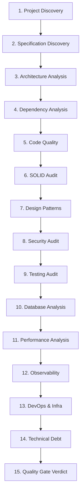

# Workflow: /audit — Auditoria Técnica Completa

---

## 1. Objetivo
Executar a auditoria técnica exaustiva de um repositório, projeto ou sistema de software, cobrindo integralmente as **15 etapas sequenciais de engenharia**. O workflow diagnostica conformidade arquitetural, segurança, qualidade de código, testabilidade e dívida técnica, culminando na emissão do relatório executivo e na determinação do Quality Gate (`PASS`, `REVIEW`, `BLOCKED`).

> [!IMPORTANT]
> **Regra Fundamental de Auditoria**: O workflow `/audit` é estritamente **read-only**. O agente **NUNCA deve alterar, refatorar ou modificar arquivos de código-fonte** durante uma auditoria, a menos que haja solicitação prévia e explícita do usuário.

---

## 2. Skills Utilizadas
* [SKILLS/sdd](../SKILLS/sdd/SKILL.md)
* [SKILLS/architecture](../SKILLS/architecture/SKILL.md)
* [SKILLS/code-review](../SKILLS/code-review/SKILL.md)
* [SKILLS/clean-code](../SKILLS/clean-code/SKILL.md)
* [SKILLS/solid](../SKILLS/solid/SKILL.md)
* [SKILLS/security](../SKILLS/security/SKILL.md)
* [SKILLS/testing](../SKILLS/testing/SKILL.md)

---

## 3. Arquivos Consultados
* Todo o repositório sob escopo da auditoria.
* Documentação de requisitos e especificações em `PROJECTS/<projeto>/specification/`.
* ADRs e visões em `PROJECTS/<projeto>/architecture/` e `decisions/`.
* Manifestos de build (`pom.xml`, `package.json`, `build.gradle`, `go.mod`, etc.).
* Matriz de severidade e regras de portão em `QUALITY-GATES/`.

---

## 4. Sequência de Análise (As 15 Etapas da Auditoria)

### Etapa 1: Project Discovery
* Identificar tecnologia central, linguagem, versão, framework, ferramentas de build e estrutura geral de pastas.
* Mapear o ponto de entrada da aplicação (main class, server entrypoint).

### Etapa 2: Specification Discovery
* Mapear requisitos de negócio existentes (`REQ-XXX`, user stories, READMEs de negócio).
* Avaliar se existem especificações formais de API (OpenAPI/Swagger, contratos JSON/Protobuf).

### Etapa 3: Architecture Analysis
* Identificar o estilo arquitetural predominante (Monolito, Modular, Hexagonal, Clean, Microservices).
* Auditar respeito aos limites de camadas (Domain livre de frameworks, dependências circulares).

### Etapa 4: Dependency Analysis
* Avaliar bibliotecas de terceiros quanto a versões obsoletas, dependências duplicadas e riscos conhecidos de licença.

### Etapa 5: Code Quality
* Inspecionar legibilidade, nomenclatura, métodos longos (SLAP), complexidade ciclomática e duplicações óbvias de código.

### Etapa 6: SOLID Audit
* Verificar adesão e violações aos 5 princípios: SRP, OCP, LSP, ISP e DIP.

### Etapa 7: Design Patterns & Anti-Patterns
* Catalogar os padrões de design legítimos aplicados.
* Identificar anti-padrões presentes (God Class, Anemic Domain Model com regras vazadas, etc.).

### Etapa 8: Security (SAST)
* Varredura contra vulnerabilidades OWASP: SQL/Command Injections, Hardcoded Secrets, BOLA/IDOR, CORS inseguro e sanitização deficiente.

### Etapa 9: Testing Strategy
* Diagnóstico da pirâmide de testes, asserções fracas, determinismo, mock overdose e lacunas de casos de borda.

### Etapa 10: Database & Persistence
* Mapeamento de entidades, integridade referencial, queries nativas arriscadas, índices ausentes e problema de consultas N+1.

### Etapa 11: Performance & Resource Management
* Complexidade algorítmica ($O(n^2)$), loops com I/O síncrono, vazamento de recursos (streams e conexões não fechadas).

### Etapa 12: Observability
* Auditoria de logs estruturados (ausência de `System.out.println` ou `console.log`), correlação de rastreabilidade (traceId/spanId) e métricas de saúde.

### Etapa 13: DevOps & Containers
* Avaliação de `Dockerfile` (otimização de camadas, execução com usuário não-root), compose files e pipelines CI/CD.

### Etapa 14: Technical Debt Assessment
* Consolidação do passivo técnico, custo futuro de manutenção e taxa de juros da dívida acumulada.

### Etapa 15: Quality Gate
* Consolidação da contagem de findings por severidade (P0, P1, P2, P3).
* Determinação do veredito final: `PASS`, `REVIEW` ou `BLOCKED`.

---

## 5. Formato da Saída
Relatório executivo estruturado segundo [TEMPLATES/audit-report.md](../TEMPLATES/audit-report.md):
* **Context**: Metadados da auditoria e escopo.
* **Findings**: Todos os apontamentos categorizados (ID, Severity, Location, Problem, Evidence, Impact, Recommendation).
* **Architecture**: Visão estrutural consolidada.
* **Risks**: Riscos operacionais e de negócio.
* **Recommendations**: Plano de ação priorizado (Curto, Médio, Longo Prazo).
* **Quality Gate**: Veredito objetivo determinístico (`PASS`, `REVIEW`, `BLOCKED`).
* **Knowledge Candidates**: Sugestões de aprendizado para envio ao `BRAIN/99-INBOX/`.

---

## 6. Condições de Sucesso
* Todas as 15 etapas sequenciais são percorridas.
* Nenhum arquivo de código do projeto é alterado durante a auditoria.
* Veredito do Quality Gate é estritamente aderente à presença de findings P0/P1/P2.
